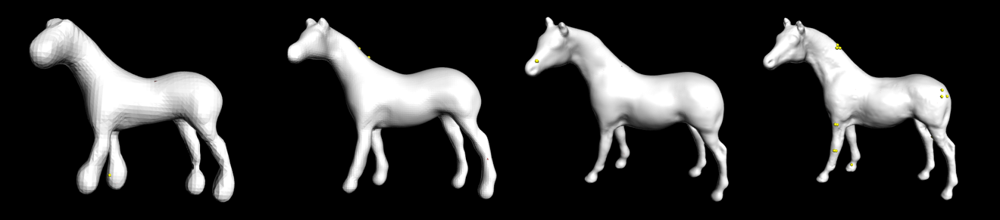
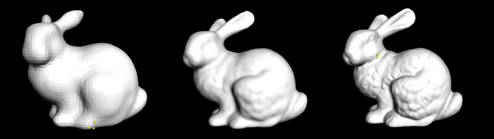

# 简介

  

该项目旨在复现Michael Kazhdan等人于**2006**年提出的**泊松表面重建算法**（Poisson Surface Reconstruction）。关于算法的详细介绍请参见原论文☞[SGP06.pdf (jhu.edu)](https://www.cs.jhu.edu/~misha/MyPapers/SGP06.pdf)。

下面是一些**实验结果**。

- 模型马

  下图显示的是模型马有向点云数据集（./data sets/horse.npts.txt）在深度设置为6至9时的实验结果。☟

  

  下面的表格对应的是这4种深度下的重建模型的各项数据。☟

  | depth | vertices | triangles | totalTime | peakMemory | kernelDepth |
  | :---: | :------: | :-------: | :-------: | :--------: | :---------: |
  |   6   |   5210   |   10410   |  149  s   |   66  MB   |      3      |
  |   7   |  17,692  |  35,370   |  556  s   |  175  MB   |      4      |
  |   8   |  65,350  |  130,660  |  3361  s  |  548  MB   |      5      |
  |   9   | 260,744  |  521,322  | 29,556  s |  1826  MB  |      5      |

- 斯坦福兔子

  下图显示的是斯坦福兔子有向点云数据集（./data sets/bunny.bnpts）在深度设置为6至8时的实验结果。☟

  

  下面的表格对应的是这3种深度下的重建模型的各项数据。☟

  | depth | vertices | triangles | totalTime | peakMemory | kernelDepth |
  | :---: | :------: | :-------: | :-------: | :--------: | :---------: |
  |   6   |   6490   |  12,975   |  328  s   |  175  MB   |      3      |
  |   7   |  27,376  |  54,746   |  2758  s  |  937  MB   |      7      |
  |   8   | 125,654  |  251,280  |  8896  s  |  3692  MB  |      8      |

# 运行环境

- 项目在windows10平台下的visual studio进行开发。
- 项目的编译以及运行环境均是64位（32位下程序会崩溃，原因在于程序的内存消耗较大）。

# 特性

- 代码内提供丰富的注释，在阅读原论文的基础上能够帮助你快速理解泊松表面重建算法。

# 不足

- 对大型数据集的支持性不好。根本原因在于求解大型稀疏线性系统时采用的是没有预处理的CG算法，如果你想进行优化，则其中一个方向是采用多重网格算法求解这个线性系统。
- 内存消耗量大。项目中的相当一部分内容都可以进一步优化。
